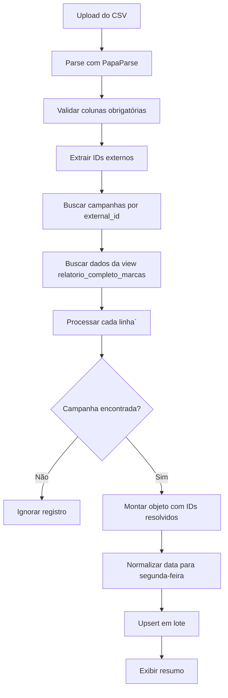

# Serviço de Relatório de Anúncios

> Documentação técnica da integração com a tabela `relatorio_anuncios` no Supabase.

---

## 📁 Arquivos Relacionados

| Arquivo | Descrição |
|---------|-----------|
| `src/services-apis/supabase/relatorioAnunciosService.js` | Serviço de API com funções CRUD, agregações e importação CSV |
| `src/pages/Relatorios.jsx` | Página React de relatórios |
| `src/components/relatorios/ImportadorCSV.jsx` | Componente de importação de CSV |
| `src/components/relatorios/ImportadorCSV.css` | Estilos do importador |
| `src/styles/relatorios.css` | Estilos CSS da página |

---

## 🗄️ Estrutura da Tabela `relatorio_anuncios`

| Coluna | Tipo | Obrigatório | Descrição |
|--------|------|-------------|-----------|
| `id` | uuid | ✅ | Chave primária |
| `anuncio_id` | uuid | ✅ | FK para `anuncios` (UNIQUE com data_inicio) |
| `marca_id` | uuid | ❌ | FK para `marcas` |
| `plataforma_id` | uuid | ❌ | FK para `plataformas` |
| `conta_de_anuncio_id` | uuid | ❌ | FK para `contas_de_anuncio` |
| `modelo_id` | uuid | ❌ | FK para `modelos` |
| `data_inicio` | date | ✅ | Data de início da semana (UNIQUE com anuncio_id) |
| `data_fim` | date | ✅ | Data de fim da semana |
| `spend` | numeric | ❌ | Valor investido (métrica absoluta) |
| `cpc` | numeric | ❌ | Custo por clique (métrica relativa) |
| `ctr` | numeric | ❌ | Taxa de cliques (métrica relativa) |
| `conversao` | numeric | ❌ | Número de conversões (métrica absoluta) |
| `criado_em` | timestamp | ❌ | Data de criação |
| `atualizado_em` | timestamp | ❌ | Data de última atualização |

### Regra de Unicidade

A tabela possui uma constraint `UNIQUE` na combinação `(anuncio_id, data_inicio)`. Isso significa que:
- Cada anúncio pode ter apenas **um registro por semana**
- Tentativas de inserir duplicatas acionam o mecanismo de **upsert** (atualização)

---

## 📊 Funções do Serviço

### Utilitários de Tratamento de Dados

#### `parseMetricValue(value)`
Converte strings formatadas em números decimais.

```javascript
// Exemplos de uso:
parseMetricValue("R$ 1.234,56")  // → 1234.56
parseMetricValue("2,5%")         // → 2.5
parseMetricValue(100)            // → 100 (números passam direto)
```

#### `normalizeToMonday(date)`
Normaliza uma data para a segunda-feira da semana correspondente.

```javascript
// Exemplo:
normalizeToMonday("2025-12-10")  // → "2025-12-08" (segunda-feira)
```

> **Importante**: Esta função é essencial para a regra de unicidade funcionar corretamente.

#### `formatCurrency(value)` / `formatPercentage(value)`
Formatadores para exibição na UI.

```javascript
formatCurrency(1234.56)    // → "R$ 1.234,56"
formatPercentage(2.5)      // → "2,50%"
```

---

### CRUD

#### `buscarTodosRelatoriosAnuncios()`
Retorna todos os relatórios com joins nas tabelas relacionadas.

```javascript
const relatorios = await buscarTodosRelatoriosAnuncios();
// Retorna: Array com anuncios, marcas, plataformas, etc.
```

#### `buscarRelatoriosComFiltros(filtros)`
Busca relatórios aplicando filtros.

```javascript
const filtros = {
    marca_id: 'uuid-da-marca',
    plataforma_id: 'uuid-da-plataforma',
    conta_de_anuncio_id: 'uuid-da-conta',
    modelo_id: 'uuid-do-modelo',
    data_inicio: '2025-12-01',
    data_fim: '2025-12-31'
};
const relatorios = await buscarRelatoriosComFiltros(filtros);
```

#### `upsertRelatorioAnuncio(dadosRelatorio)`
Insere ou atualiza um registro usando a combinação `anuncio_id + data_inicio`.

```javascript
const resultado = await upsertRelatorioAnuncio({
    anuncio_id: 'uuid-do-anuncio',
    marca_id: 'uuid-da-marca',
    data_inicio: '2025-12-10',  // Será normalizado para segunda-feira
    data_fim: '2025-12-16',
    spend: 'R$ 1.500,00',       // Aceita string formatada
    cpc: '2,50',                // Será convertido para 2.5
    ctr: '1,8%',                // Será convertido para 1.8
    conversao: 25
});
```

#### `importarRelatoriosEmLote(registros)`
Importa múltiplos registros de uma vez (útil para importação de planilhas).

```javascript
const resultado = await importarRelatoriosEmLote([
    { anuncio_id: '...', spend: 'R$ 100,00', ... },
    { anuncio_id: '...', spend: 'R$ 200,00', ... }
]);
// Retorna: { total: 2, sucessos: 2, erros: 0, errosDetalhados: [] }
```

#### `deletarRelatorioAnuncio(id)`
Remove um relatório pelo ID.

```javascript
const sucesso = await deletarRelatorioAnuncio('uuid-do-relatorio');
// Retorna: true/false
```

---

### Agregações e Estatísticas

#### `calcularEstatisticasAgregadas(filtros)`
Calcula estatísticas consolidadas para o período/filtros.

```javascript
const stats = await calcularEstatisticasAgregadas({
    data_inicio: '2025-12-01',
    data_fim: '2025-12-31',
    marca_id: 'uuid-opcional'
});

// Retorna:
{
    totalInvestido: 15000.00,    // SOMA de spend
    totalConversoes: 250,        // SOMA de conversao
    ctrMedio: 2.35,              // MÉDIA de ctr
    cpcMedio: 1.80,              // MÉDIA de cpc
    totalRegistros: 45
}
```

#### `calcularInvestimentoPorMarca(filtros)`
Agrupa investimentos e métricas por marca.

```javascript
const porMarca = await calcularInvestimentoPorMarca(filtros);

// Retorna:
[
    {
        marca_id: 'uuid',
        marca_nome: 'Toyota',
        totalInvestido: 8000.00,
        totalConversoes: 150,
        ctrMedio: 2.5,
        cpcMedio: 1.75
    },
    // ...
]
```

#### `buscarTendenciaSemanal(filtros)`
Retorna dados para gráficos de tendência com granularidade semanal.

```javascript
const tendencia = await buscarTendenciaSemanal(filtros);

// Retorna:
[
    { semana: '2025-12-02', totalInvestido: 2000, totalConversoes: 50, ... },
    { semana: '2025-12-09', totalInvestido: 2500, totalConversoes: 65, ... },
    // ...
]
```

#### `gerarRelatorioMensal(ano, mes)`
Gera relatório mensal completo com todas as métricas.

```javascript
const relatorio = await gerarRelatorioMensal(2025, 12);

// Retorna:
{
    periodo: { ano: 2025, mes: 12, dataInicio: '2025-12-01', dataFim: '2025-12-31' },
    estatisticas: { totalInvestido, totalConversoes, ctrMedio, cpcMedio },
    investimentoPorMarca: [...],
    tendenciaSemanal: [...]
}
```

---

## 📋 Lógica de Negócio

### Regras de Agregação

| Tipo de Métrica | Operação | Exemplos |
|-----------------|----------|----------|
| **Absoluta** | SOMA | `spend`, `conversao` |
| **Relativa** | MÉDIA | `cpc`, `ctr` |

### Tratamento de Datas

1. **Normalização para Segunda-feira**: Toda `data_inicio` é ajustada para a segunda-feira da semana correspondente antes de salvar
2. **Motivo**: Garante que a regra de unicidade `(anuncio_id, data_inicio)` funcione corretamente para dados semanais

### Tratamento de Métricas

1. **Strings formatadas são aceitas**: O serviço converte automaticamente
   - `"R$ 1.234,56"` → `1234.56`
   - `"2,5%"` → `2.5`
2. **Números passam direto**: Se já for número, não há conversão

---

## 🖥️ Página de Relatórios

### Cards de Estatísticas (KPIs)

A página exibe 4 cards principais:

| Card | Fonte | Cor |
|------|-------|-----|
| **Total Investido** | `estatisticas.totalInvestido` | Verde |
| **Total de Conversões** | `estatisticas.totalConversoes` | Padrão |
| **CTR Médio** | `estatisticas.ctrMedio` | Azul |
| **CPC Médio** | `estatisticas.cpcMedio` | Âmbar |

### Seção Investimento por Marca

- Grid de cards individuais para cada marca
- Cada card exibe: Valor investido, Conversões, CTR e CPC da marca

### Tabela de Tendência Semanal

- Mostra evolução semana a semana
- Colunas: Semana, Investido, Conversões, CTR Médio, CPC Médio

### Filtros Disponíveis (Cascata via View `relatorio_completo_marcas`)

| Filtro | Tipo | Comportamento |
|--------|------|---------------|
| **Marca** | Select | Populado a partir da view. Ao mudar, reseta Plataforma e Conta. |
| **Plataforma** | Select | Filtrado com base na Marca selecionada. Ao mudar, reseta Conta. |
| **Conta de Anúncio** | Select | Filtrado com base na Marca E Plataforma selecionadas. |
| **Período** | Select | Este Mês, Últimos 7/15 dias, Mês Passado, Últimos 6 meses, Personalizado. |
| **Data Início** | Date | Livre. |
| **Data Fim** | Date | Livre. |

> **Importante**: Os filtros são populados usando a view `relatorio_completo_marcas` que já resolve automaticamente os relacionamentos 1:1 (Meta) e N:1 (Google) entre marcas e contas.

---

## 🔄 Importação de CSV (Meta Ads)

### Componente ImportadorCSV

O componente `ImportadorCSV` permite importar relatórios exportados do Meta Ads em formato CSV.

**Funcionalidades:**
- Drag-and-drop de arquivos
- Validação de colunas obrigatórias
- Preview dos dados antes da importação
- Feedback visual do progresso
- Resumo detalhado com registros importados/ignorados/erros

### Mapeamento de Colunas (CSV → Banco)

| Coluna CSV | Campo Banco | Tratamento |
|------------|-------------|------------|
| `Identificação da campanha` | `anuncio_id` (via lookup) | Busca UUID pelo external_id |
| `Nome da conta` | `conta_de_anuncio_id` | Via view `relatorio_completo_marcas` |
| `Início dos relatórios` | `data_inicio` | Normaliza para segunda-feira |
| `Término dos relatórios` | `data_fim` | Conversão direta |
| `Valor usado (BRL)` | `spend` | Float |
| `CPC (custo por clique no link) (BRL)` | `cpc` | Float |
| `CTR (taxa de cliques no link)` | `ctr` | Float |
| `Resultados` | `conversao` | Integer |

### Funções do Serviço para Importação

#### `buscarCampanhasPorExternalId(externalIds)`
Cria mapa de IDs externos (Meta) para UUIDs internos.

```javascript
const mapa = await buscarCampanhasPorExternalId(['120228803541830714', '...']);
// Retorna: { '120228803541830714': { id: 'uuid', marca_id: 'uuid' } }
```

#### `buscarRelatorioCompletoMarcas()`
Consulta a view consolidada para obter IDs de marca/plataforma/conta.

```javascript
const mapaContas = await buscarRelatorioCompletoMarcas();
// Retorna: { 'Conta Zontes': { marca_id, plataforma_id, conta_id } }
```

#### `importarCSVRelatorioAnuncios(dadosCSV)`
Função principal que orquestra todo o fluxo de importação.

```javascript
const resultado = await importarCSVRelatorioAnuncios(dadosParseados);

// Retorna:
{
    sucesso: true,
    mensagem: 'Importação concluída: 25 registros importados',
    resumo: { total: 31, importados: 25, ignorados: 5, erros: 1 },
    detalhes: { registrosIgnorados: [...], erros: [...] }
}
```

### Fluxo de Importação



### Registros Ignorados

Registros são ignorados quando:
1. **Campanha não encontrada**: O `external_id` (Identificação da campanha) não existe na tabela `campanhas`
2. **Sem investimento**: `spend = 0` e `conversao = 0`

---

## 📅 Histórico

| Data | Alteração |
|------|-----------|
| 2025-12-10 | Criação inicial do serviço e integração com a página de relatórios |
| 2025-12-10 | Implementação do componente ImportadorCSV com suporte a Meta Ads |
| 2025-12-10 | Funções de resolução de IDs externos e importação em lote |
| 2025-12-10 | Refatoração para usar view `relatorio_completo_marcas` e filtros em cascata (Marca → Plataforma → Conta) |
| 2025-12-10 | Sidemenu de importação com seleção obrigatória de conta antes do upload |


